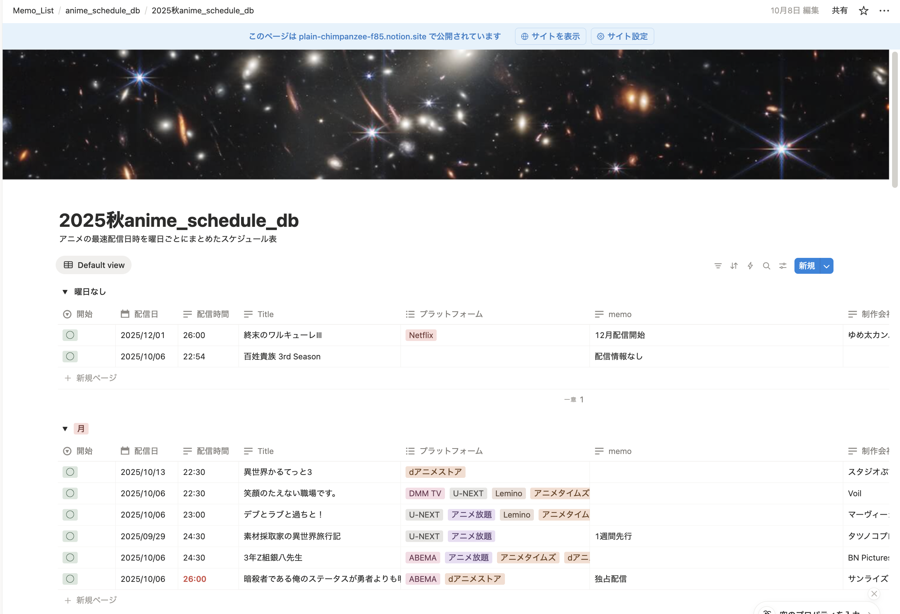
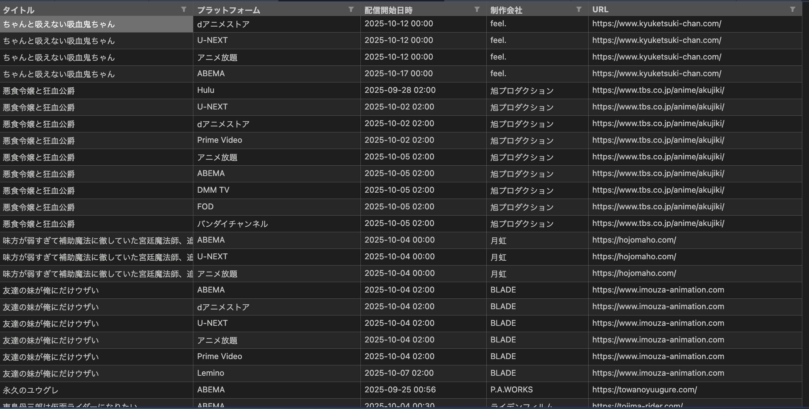
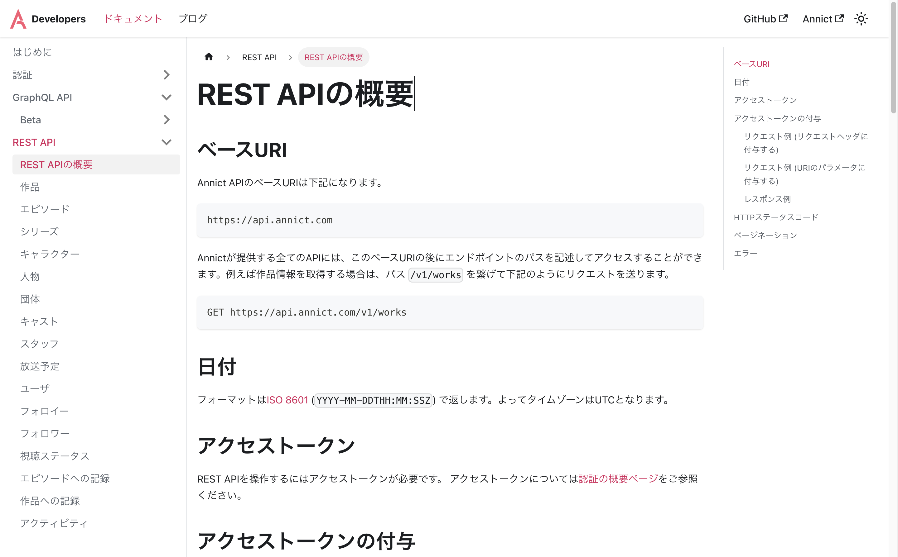
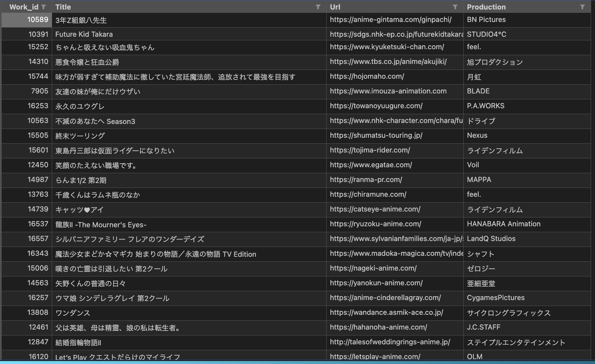

# ⏰ **AniTime_app**

## **今期アニメの最速配信情報をスクレイピングで取得しNotionDBへ登録するスクリプト**

🔍 アニメ情報取得（API） → 🎨 対応表作成 → 📋 アニメHPへ連続スクレイピング → 🔎 最速配信情報を抽出 → NotionDB新規作成（API） → DBへデータ登録


---

# 🖼️ 画面イメージ

### ▼NotionDB画面（Notion APIを使用）


### ▼スクレイピングで抽出したデータ（Python）


### ▼アニメ情報取得(Annict APIを使用)

### ▼アニメ情報取得(Annict APIを使用)


---


# 🚀プログラムの概要
>このスクリプトは、各クール（年４回）放送予定のアニメの最速配信情報をスクレイピングで取得し、NotionDBを新規作成後、DBへデータを登録するスクリプトです。またDBは作成ぜず、CSVファイルを内部DBとして扱うように設計しています。3ヶ月ごとの年４回のスクレイピング実行を想定し設計
---

# 🤖創作物コンセプト
>毎期40作品ほどアニメを視聴しており、アニメ放送の直前にアニメ最速の「タイトル／配信日時プラットフォーム名」の一覧リストを手動で作成しまとめる作業を自動化したかったからです。

---

# 🧩 主な機能

## アニメ情報取得 （annict_get_api.py）
- 📥 REST APIを使用し作品情報の取得
- ✔  APIのページ更新制御
- 🔍 対応表の作成


## スクレイピング （scraper.py）
- 📊 公式URLへ連続しアクセス
- 🎪 BueautifulSoupでHTML解析
- ✔  最速日時候補の重み付け
- 🔍 対応したプラットフォーム名の日時を抽出する正規表現パターンのハンドラーうを用意

## Notion　（notion.py）
- 📊 DBの存在チェック
- 🎪 DBのアーカイブ化
- ✔  DBの新規作成
- 🔍 レコードの追加

## ローカルCSV　（.csv）／ログ（.log）
- 📝 CSVローカルキャッシュ利用（作成済みの場合は何もしない）
- ✒️ スクレイピングおよびNotionDB登録時にログ書き出し

---

# ディレクトリ構成
```
├── AniTime_app
│   ├── app
│   │   ├── annict_get_api.py
│   │   ├── notion_register.py
│   │   ├── scraper.py
│   │   └── __init__.py
│   ├── common
│   │   ├── utils.py
│   │   └── __init__.py
│   ├── data
│   │   ├── ng_datetime.log
│   │   ├── ng_list.csv
│   │   ├── anime_schedule
│   │   │   ├── 2025_summer_scrap.csv
│   │   │   └── 2025_autumn_scrap.csv
│   │   └── works
│   │       ├── 2025_summer.csv
│   │       └── 2025_autumn.csv
│   ├── logs
│   │   ├── app.log
│   │   ├── app.log.1
│   │   └── notion.log
│   ├── model
│   │   ├── config.py
│   │   ├── handler.py
│   │   └── logging_config.py
│   └── tests
│       └── __init__.py
├── .env
├── .gitignore
├── dirtree.txt
├── main.py →プログラムの起点
├── README.md
├── requirements.txt
└── season_switch.sh
```


# 💻使用技術
## 言語
  - Python3.13.5
## IDE
  - Visual Studio Code
  
## 🔑API
  - Annict
  - Notion
  
## 外部ライブラリ
  - requests
  - bs4（Beautifulsoup）
  - notion-client
  - python-dotenv
  - typing

## 使用技術
  - APIを使用した外部サイトとの連携・データ取得
  - Webスクレイピング
  - データの前処理・加工
  
# 🏗️ アーキテクチャ構成
- `main.py`：プログラムの起点
- `annict_get_api`：アニメ情報の取得
- `scraper.py`：最速配信情報のスクレイピング
- `notion.py`：NotionDBの作成＋データ登録
- `handler.py`：正規表現パターンの管理
- `config.py`：全体の設定関連＋定数を管理
- `.csv`：ローカルDB＆ローカルキャッシュ
- `.log`：ログの管理

  
